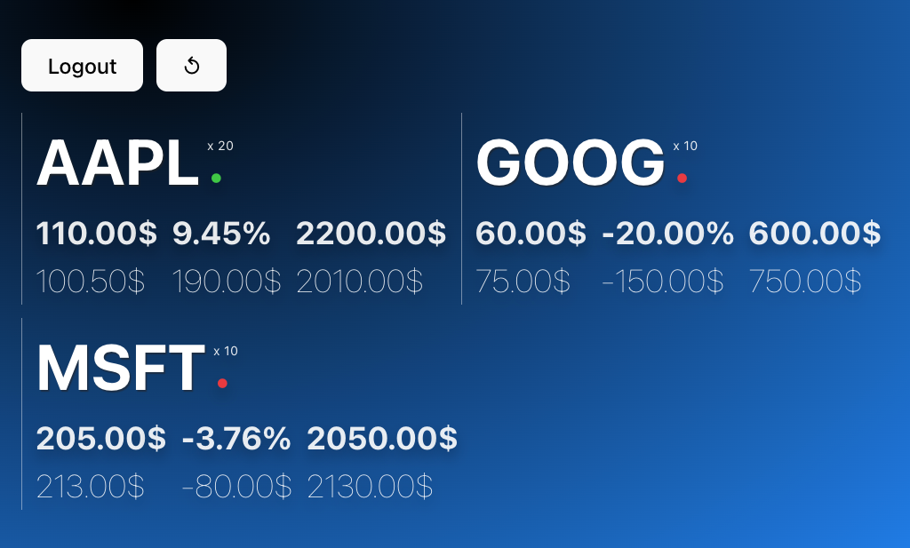

# questrade-app

Simple app that interops with the Questrade API.

**Why?**

Ease watching my assets in a minimalist way and to skip the lengthy process of going on Questrade authentication.

**Features**

In addition to adding support for implicit grant oauth to Questrade API, it includes a clean boilerplate that could serve building other apps.

- Both front-end and back-end use docker with hot reloading for both frontend / backend
- It is lightweight to setup and can be deployed if needed to any container based provider

**Demo**



## Stack

[](https://mermaid.live/edit#pako:eNptUU1TgzAQ_SuZPdUZCkmgCXBwbK2d8eCMXyfFQ0pCYQqECUGtbf-7odWDM24uydt9-_J295BrqSCFotYfeSmMRc_LrEUu5q8ro1s7Va1EU_SoRG7RFUKltV0aBIRyH7tDUoYxeUPT6eUBHdBishD59oezqkW_dZz_KPTirLL4ZV5PHgbVWyOkQvP7W5cGDxplGlFJ97_9WJ6BLVWjMkjdVQqzzSBrj65ODFY_7docUmsG5cHQSWHVshIbI5q_4I2srDaQFqLuHVhrJ-iee7C7bhzEpuqt65jrtqg2Iz6Y2sGjh96ZGNP-prLlsPZz3QR9Jceple8JCxhlsaChYjwUszCU-ZokcUEjUkiOCRVwPHrQiXbs-gkpJZHPo4TjJIkJiRn1YAcpwdynmPNoFrKIJ4w5zpfWzgX2Z_gccZTEYRhyD9TJzd15h6dVnhReToTR9vEbT6GP3w)

Both are built using a dockerfile that can be ran locally and deployed to cloud provider of choice.

## Pre-requisites

To run locally, you minimally need:

- [Docker](https://www.docker.com/products/docker-desktop).
- [Questrade App Hub](https://www.questrade.com/partner-centre/app-hub)
  - This repo depends on the Questrade API, you will need to setup your own app from their site and ensure you provide an https callback.
  - To do so, you can use ngrok after fetching your authorization token from their site:

    ```sh
    brew install ngrok/ngrok/ngrok
    ngrok config add-authtoken <INSERT-YOUR-AUTH-TOKEN>
    ngrok http 6001
    ```

  - In api/.env, update CORS_ORIGIN_QUESTRADE_CALLBACK with ngrok generated https URL
  - From, your Questrade App, copy/paste your consumer key and redirect uri (prior ngrok generated endpoint) to fill in the following URL:

    ```sh
    https://login.questrade.com/oauth2/authorize?client_id=<QUESTRADE-CLIENT-ID>&response_type=token&redirect_uri=<NGROK-URL>
    ```

  - Go through Questrade authorization, then it will redirect to locally running app

## Running locally

Ensure you have Docker running then call docker-compose:

```sh
docker-compose up --build -d 
```

Browse to <http://127.0.0.1:6001>.

## Code changes locally

If you use VS Code, no need to install locally node/python or any dependencies.
You can simply install VS Code extension [Dev Containers](https://code.visualstudio.com/remote/advancedcontainers/overview).

Use `Ctrl + Shift + P`, then select `Dev Containers: Attach to running containers..`.
Select either the ui (front end) and/or api ().

It will spawn a new window, any changes will be reflected.

# Auth

We use "Implicit Grant OAuth" flow documented here: <https://www.questrade.com/api/documentation/authorization?TSPD_101_R0=08005b7230ab2000a813ef08eeb33a9bf24b1b1e9cee0fd2bec84c626a9eb9c366751f8d0d47dc9108fbb0473f1430009a473cf802d3836dffe94b52ae48a8f00853d9cacbaaeeac611aba93d7d6a48ff7716a6e4794c6fee5a164944928e260>
