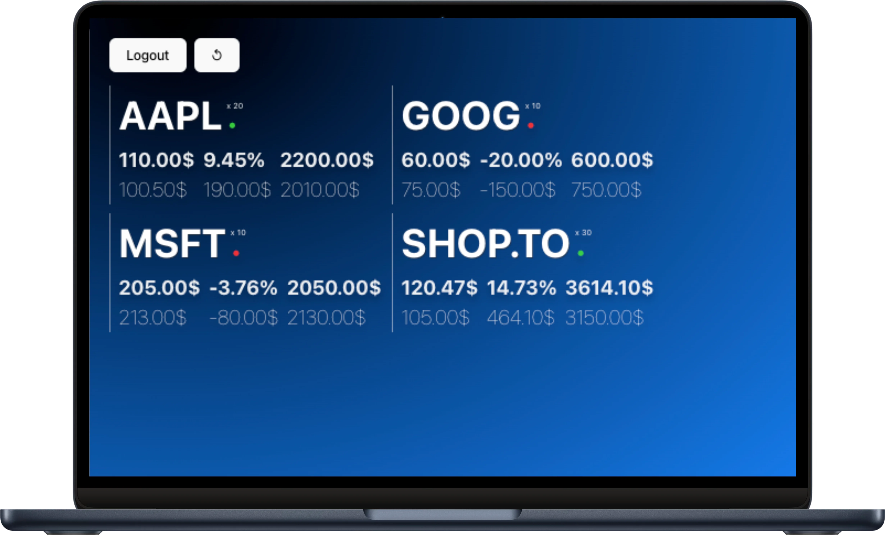

# questrade-app

Simple way to monitor your investments through Questrade.



<br>

## Why?

I understand the importance of having a tool that provides a minimalist view of your assets while ensuring quick updates. That's why I created this app – keeping an eye on your stocks without any unnecessary clutter.

## Features

- Adds support for implicit grant oauth against the Questrade API [link](https://www.questrade.com/api/documentation/authorization)
- Includes a clean boilerplate that could serve building other apps
- Both front-end and back-end use docker with hot reloading
- It is lightweight to setup and can be deployed if needed to any container based provider

## Stack

[](https://mermaid.live/edit#pako:eNptUU1TgzAQ_SuZPdUZCkmgCXBwbK2d8eCMXyfFQ0pCYQqECUGtbf-7odWDM24uydt9-_J295BrqSCFotYfeSmMRc_LrEUu5q8ro1s7Va1EU_SoRG7RFUKltV0aBIRyH7tDUoYxeUPT6eUBHdBishD59oezqkW_dZz_KPTirLL4ZV5PHgbVWyOkQvP7W5cGDxplGlFJ97_9WJ6BLVWjMkjdVQqzzSBrj65ODFY_7docUmsG5cHQSWHVshIbI5q_4I2srDaQFqLuHVhrJ-iee7C7bhzEpuqt65jrtqg2Iz6Y2sGjh96ZGNP-prLlsPZz3QR9Jceple8JCxhlsaChYjwUszCU-ZokcUEjUkiOCRVwPHrQiXbs-gkpJZHPo4TjJIkJiRn1YAcpwdynmPNoFrKIJ4w5zpfWzgX2Z_gccZTEYRhyD9TJzd15h6dVnhReToTR9vEbT6GP3w)

## Running locally

To run locally, you minimally need:

- [Questrade App Hub](https://www.questrade.com/partner-centre/app-hub)
  - This repo depends on the Questrade API, you will need to setup your own app from their site and ensure you provide an https callback.
  - To do so, you can use ngrok after fetching your authorization token from their site:

    ```sh
    brew install ngrok/ngrok/ngrok
    ngrok config add-authtoken <INSERT-YOUR-AUTH-TOKEN>
    ngrok http 6001
    ```

  - In ./backend/.env:
    - Update CORS_ORIGIN_QUESTRADE_CALLBACK with ngrok generated https URL above
    - Update QUESTRADE_CLIENT_ID with you Questrade App Hub consume key

- [Docker](https://www.docker.com/products/docker-desktop)
  
  ```sh
  docker-compose up --build -d 
  ```

- Browse to <http://127.0.0.1:6001>
